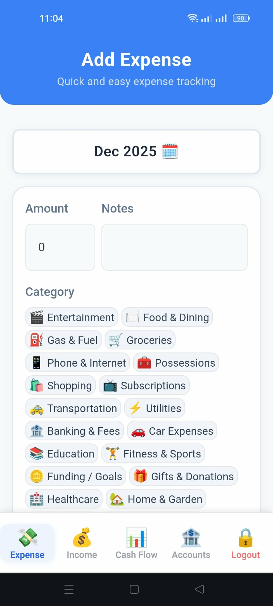
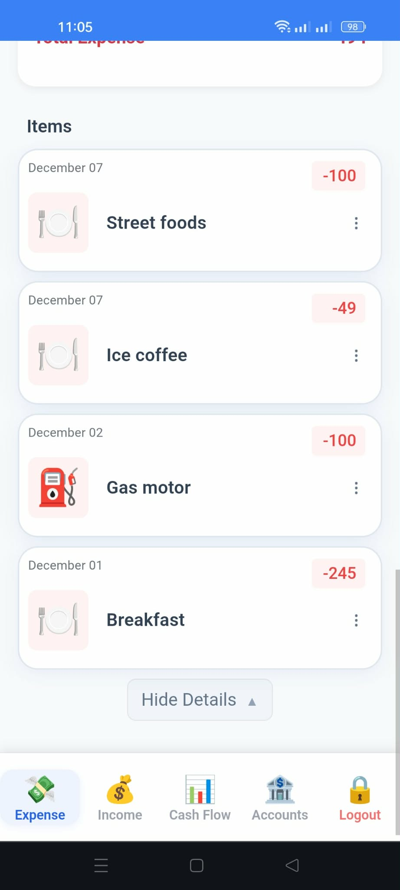
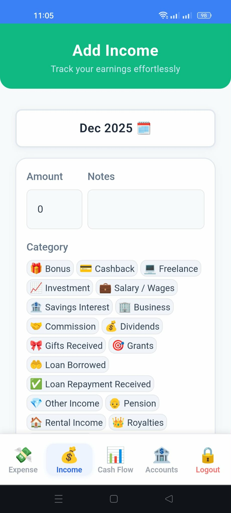
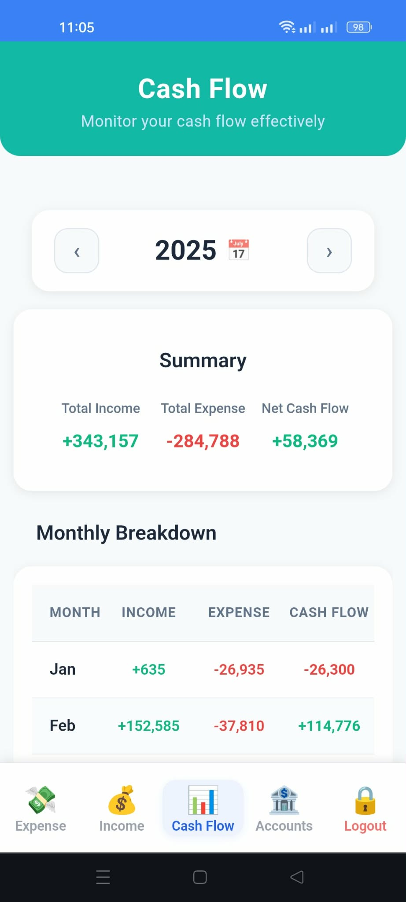
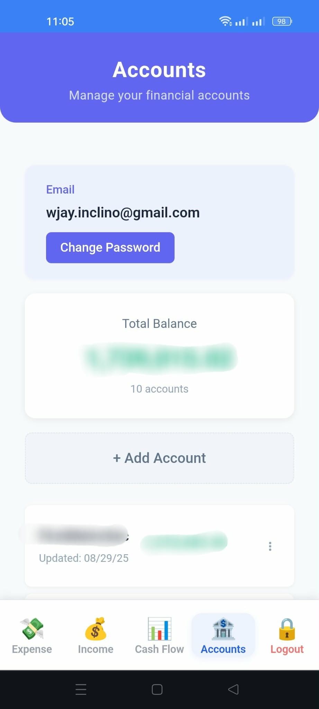
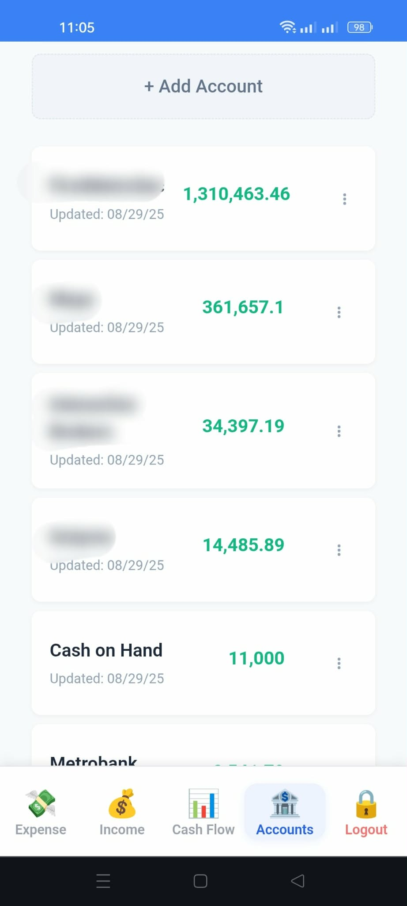

<div align="center">

# 💰 MoneyFlow

### Personal Finance Management Made Simple

**Track expenses • Monitor income • Visualize cash flow • Achieve financial goals**

🌐 **Progressive Web App (PWA)** - Install on any device, works offline

<br>

## [🚀 **Live Demo** →](https://jaytechsolutions.cloud/moneyflow-pwa)

<br>

[](https://www.typescriptlang.org/)
[](https://reactnative.dev/)
[](https://vuejs.org/)
[](https://nestjs.com/)
[](https://www.postgresql.org/)
[](https://www.prisma.io/)

</div>

---

## 📋 Overview

MoneyFlow is a comprehensive personal finance management **Progressive Web Application (PWA)** designed to help users take control of their financial life. Built with modern technologies and best practices, it provides an intuitive interface for tracking expenses, monitoring income, analyzing cash flow patterns, and managing multiple accounts.

**🌐 PWA Benefits:**
- 📱 **Install on any device** - Works like a native app on desktop, mobile, and tablet
- ⚡ **Lightning fast** - Optimized performance with caching strategies
- 🔌 **Works offline** - Access your financial data even without internet
- 🔔 **Push notifications** - Stay updated on your financial activities
- 💾 **Minimal storage** - No need to download from app stores

## ✨ Key Features

### 💸 Expense Management
- **Track expenses** with detailed categorization
- **View comprehensive expense lists** with filtering and sorting
- **Analyze spending patterns** with interactive charts and analytics
- **Set budgets** and monitor spending limits

### 💵 Income Management
- **Record income** from multiple sources
- **View income history** with detailed breakdowns
- **Analyze income trends** over time
- **Track income categories** for better financial planning

### 📊 Cash Flow Visualization
- **Monthly cash flow views** for any year
- **Visual representations** of income vs. expenses
- **Identify patterns** and trends in your financial health
- **Year-over-year comparisons** for long-term insights

### 🏦 Account Management
- **Manage multiple accounts** (savings, checking, credit cards, etc.)
- **Track balances** across all accounts
- **Monitor account activity** and transactions
- **Account-specific reports** and analytics

---

## 🖼️ Screenshots

<div align="center">

### Expense Management



### Income Management


### Cash Flow & Analytics


### Account Management



</div>

---

## 🏗️ Architecture

This project follows a modern full-stack architecture with separate client and server applications:

### 📱 **moneyflow-mobile**
- **Tech Stack:** React Native, TypeScript, WatermelonDB
- **Platform:** iOS & Android
- Native mobile experience with offline-first capabilities
- Smooth animations and native performance

### 🌐 **moneyflow-pwa** ⭐ *Primary Application*
- **Tech Stack:** Vue 3, TypeScript, Vite, PWA, Workbox
- **Progressive Web App** for true cross-platform accessibility
- **Installable** on desktop and mobile devices (no app store needed)
- **Offline-first architecture** with service worker caching
- **Push notifications** for real-time updates
- **App-like experience** with smooth transitions and native feel
- **Automatic updates** - Always get the latest features

### 💻 **moneyflow-web**
- **Tech Stack:** Vue 3, TypeScript, Vite
- Responsive web application
- Optimized for desktop browsing experience

### ⚙️ **moneyflow-api**
- **Tech Stack:** NestJS, TypeScript, Prisma, PostgreSQL
- RESTful API with JWT authentication
- Database migrations and seeding
- Robust error handling and validation
- Docker support for easy deployment

---

## 🛠️ Tech Stack

### Frontend
- **Vue 3 + PWA** - Progressive Web App (primary platform)
- **React Native** - Mobile application framework
- **TypeScript** - Type-safe development
- **Vite** - Next generation frontend tooling
- **Workbox** - PWA service worker management
- **WatermelonDB** - Reactive database for mobile

### Backend
- **NestJS** - Progressive Node.js framework
- **Prisma** - Next-generation ORM
- **PostgreSQL** - Robust relational database
- **JWT** - Secure authentication
- **Docker** - Containerization

### DevOps
- **PM2** - Production process manager
- **Docker Compose** - Multi-container orchestration
- **Git** - Version control

---

## 🚀 Getting Started

### Prerequisites
- Node.js (v16 or higher)
- PostgreSQL (v13 or higher)
- Docker & Docker Compose (optional)
- React Native environment setup (for mobile development)

### Installation

1. **Clone the repository**
```bash
git clone https://github.com/William-Jay-Inclino/moneyflow.git
cd moneyflow
```

2. **Set up the API**
```bash
cd moneyflow-api
npm install
cp .env.example .env
# Configure your database connection in .env
npx prisma migrate dev
npx prisma db seed
npm run start:dev
```

3. **Set up the Web Application**
```bash
cd moneyflow-web
npm install
cp .env.example .env
# Configure API endpoint in .env
npm run dev
```

4. **Set up the PWA**
```bash
cd moneyflow-pwa
npm install
cp .env.example .env
# Configure API endpoint in .env
npm run dev
```

5. **Set up the Mobile App**
```bash
cd moneyflow-mobile
npm install
# For Android
npm run android
# For iOS
npm run ios
```

### Docker Setup (Alternative)

```bash
cd moneyflow-api/docker
docker-compose up -d
```

---

## 📂 Project Structure

```
moneyflow/
├── moneyflow-api/        # Backend API (NestJS)
├── moneyflow-mobile/     # Mobile app (React Native)
├── moneyflow-pwa/        # Progressive Web App (Vue 3)
├── moneyflow-web/        # Web application (Vue 3)
├── backup/               # Database backups
└── readme-screenshots/   # Application screenshots
```

---

## 🔐 Security Features

- **JWT Authentication** - Secure token-based authentication
- **Password Hashing** - Bcrypt encryption for user passwords
- **Environment Variables** - Sensitive data protection
- **CORS Configuration** - Cross-origin resource sharing control
- **Input Validation** - Request payload validation and sanitization

---

## 📱 Key Functionalities

### User Authentication
- Secure registration and login
- Email verification
- Password reset functionality
- JWT-based session management

### Transaction Management
- Create, read, update, and delete transactions
- Categorize expenses and income
- Attach notes and metadata
- Multi-account support

### Analytics & Reporting
- Visual charts and graphs
- Monthly, quarterly, and yearly reports
- Category-wise breakdowns
- Custom date range analysis

### Account Management
- Multiple account types (cash, bank, credit card)
- Real-time balance updates
- Account transfer tracking
- Account-specific transaction history

---

## 🎯 Development Practices

- ✅ **TypeScript** for type safety across the entire stack
- ✅ **Modular Architecture** for maintainable and scalable code
- ✅ **RESTful API Design** following best practices
- ✅ **Database Migrations** for version-controlled schema changes
- ✅ **Environment-based Configuration** for different deployment stages
- ✅ **Error Handling** with proper logging and user feedback
- ✅ **Code Organization** with clear separation of concerns

---

## 📊 Database Schema

The application uses a robust PostgreSQL database with Prisma ORM, featuring:
- **Users** - User accounts and authentication
- **Accounts** - Financial accounts (bank, cash, credit)
- **Expenses** - Expense transactions with categories
- **Income** - Income transactions with sources
- **Categories** - Customizable expense/income categories

---

## 🔄 Scripts & Automation

### Database Management
```bash
# Backup database
./scripts/backup_moneyflow_db.sh

# Restore database
./scripts/restore_moneyflow_db.sh

# Start application
./scripts/start_moneyflow.sh
```

### Development
```bash
# Run API in development mode
npm run start:dev

# Run database migrations
npx prisma migrate dev

# Seed database
npx prisma db seed
```

---

## 🌟 Future Enhancements

- [ ] Budget planning and alerts
- [ ] Recurring transactions
- [ ] Multi-currency support
- [ ] Export to CSV/PDF
- [ ] Bill reminders
- [ ] Investment tracking
- [ ] Financial goal setting
- [ ] AI-powered insights

---

## 👨‍💻 About the Developer

This project demonstrates proficiency in:
- Full-stack development (Frontend + Backend + Mobile)
- Modern JavaScript/TypeScript ecosystem
- Database design and management
- RESTful API architecture
- Mobile-first and responsive design
- DevOps and deployment practices
- Git version control and collaboration

---

## 📄 License

This project is open source and available under the [MIT License](LICENSE).

---

## 📞 Contact

**Try the live demo:** [jaytechsolutions.cloud/moneyflow-pwa](https://jaytechsolutions.cloud/moneyflow-pwa)

For questions or opportunities, feel free to reach out!

---

<div align="center">

**Made with ❤️ and ☕**

</div>
